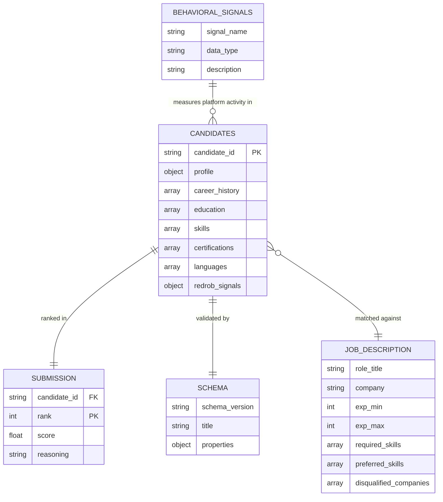

# Redrob Intelligent Candidate Discovery & Ranking Challenge — Dataset Audit Report

## 1. Dataset Overview

This audit covers the dataset provided for the **Intelligent Candidate Discovery & Ranking Challenge** hosted by **Redrob AI** (a Series A talent intelligence platform). 

The target role is a **Senior AI Engineer — Founding Team**, demanding a candidate with **5–9 years of experience** (ideally 6–8 years), deep technical expertise in modern ML retrieval and ranking (embeddings, vector search, evaluation metrics), and a scrappy, product-focused shipper attitude. 

The dataset consists of a pool of **100,000 candidate profiles** in JSON Lines format (~487 MB uncompressed) containing detailed resume structures alongside 23 behavioral/activity signals simulated from the Redrob platform. 

### Core Objectives & Constraints:
*   **Ranking Goal**: Discover and rank the **top 100 candidates** from the pool of 100,000, ordered by fit, providing a detailed 1–2 sentence reasoning for each.
*   **Honeypot Filter**: The dataset contains subtly impossible "honeypot" profiles. If a submission contains a honeypot rate of **>10% in the top 100**, it is **disqualified**.
*   **Compute Budget**: The ranking code must execute **within 5 minutes** on a standard **16 GB RAM CPU-only** machine, with **network access disabled** (no external LLM APIs like OpenAI/Gemini allowed at inference time).
*   **Evaluation Metric**: Final scores are calculated using a weighted composite: **$0.50 \times \text{NDCG@10} + 0.30 \times \text{NDCG@50} + 0.15 \times \text{MAP} + 0.05 \times \text{P@10}$**.

---

## 2. Folder Structure

The challenge directory contains the following file tree. Text versions (`.txt`) of `.docx` files have been programmatically generated during this audit to facilitate inspection:

```
E:/Desktop/H2S REDROB/India_runs_data_and_ai_challenge/
├── README.docx                        # Hackathon overview and startup guide
├── README.txt                         # Programmatically converted README text
├── candidate_schema.json              # Draft-07 JSON Schema for candidate objects
├── candidates.jsonl                   # The full pool of 100,000 candidate records (487 MB)
├── job_description.docx               # Job description for Senior AI Engineer
├── job_description.txt                # Programmatically converted job description text
├── redrob_signals_doc.docx            # Documentation for the 23 behavioral signals
├── redrob_signals_doc.txt             # Programmatically converted signals text
├── sample_candidates.json             # First 50 candidates as pretty-printed JSON (300 KB)
├── sample_submission.csv              # CSV format reference showing expected submission columns
├── submission_spec.docx               # Submission specifications, compute rules, and scoring stages
└── submission_spec.txt                # Programmatically converted submission spec text
```

---

## 3. File-by-File Summary

### 3.1 candidates.jsonl
*   **File Name**: `candidates.jsonl`
*   **File Type**: JSON Lines (UTF-8 encoded)
*   **Row Count**: 100,000
*   **Column Count**: 8 primary JSON object keys
*   **Column Names**: `candidate_id`, `profile`, `career_history`, `education`, `skills`, `certifications`, `languages`, `redrob_signals`
*   **Data Types**: 
    *   `candidate_id`: String (matches pattern `^CAND_[0-9]{7}$`)
    *   `profile`: Object containing personal metadata (experience years, current company details, industry, etc.)
    *   `career_history`: Array of Objects (nested details of past job titles, durations, companies, and descriptions)
    *   `education`: Array of Objects (schools, degrees, fields of study, tiers, grades)
    *   `skills`: Array of Objects (skill name, proficiency level, endorsements, duration months)
    *   `certifications`: Array of Objects (name, issuer, year)
    *   `languages`: Array of Objects (language name, proficiency)
    *   `redrob_signals`: Object containing 23 platform activity and engagement metrics
*   **Missing Values**: None in required fields. `career_history.end_date` is `null` if the job is current (`is_current: true`).
*   **Duplicate Values**: 0 duplicate `candidate_id`s. However, there are **46 sets of "behavioral twins"** (candidates with identical resume text/profiles but different candidate IDs and behavioral signals).
*   **Unique IDs**: `candidate_id` (CAND_0000001 through CAND_0100000).
*   **Primary Key Candidate**: `candidate_id`
*   **Foreign Key Candidates**: None (Self-contained pool).
*   **Data Quality Issues**:
    *   **65 Programmatic Honeypots**: Synthetic records with logical contradictions (impossible dates, expert skills with 0 months experience, experience gaps).
    *   **Synthetic Mismatch Noise**: 28,496 candidates have expected salary `min > max` (due to independent random variable generation). 9,231 candidates have education overlap where their Master's degree start year is before their Bachelor's end year.
*   **Example Record (Truncated CAND_0000001)**:
    ```json
    {
      "candidate_id": "CAND_0000001",
      "profile": {
        "anonymized_name": "Ira Vora",
        "headline": "Backend Engineer | SQL, Spark, Cloud",
        "summary": "Software / data professional with 6.9 years of experience... My toolkit is solid on the data engineering side...",
        "location": "Toronto",
        "country": "Canada",
        "years_of_experience": 6.9,
        "current_title": "Backend Engineer",
        "current_company": "Mindtree",
        "current_company_size": "10001+",
        "current_industry": "IT Services"
      },
      ...
    }
    ```

### 3.2 sample_candidates.json
*   **File Name**: `sample_candidates.json`
*   **File Type**: Pretty-printed JSON Array
*   **Row Count**: 50 candidate records
*   **Column Count**: 8 primary JSON keys (same as `candidates.jsonl`)
*   **Column Names / Data Types**: Identical to `candidates.jsonl`
*   **Missing Values**: None in required fields.
*   **Duplicate Values**: 0
*   **Unique IDs**: `candidate_id` (CAND_0000001 to CAND_0000050)
*   **Primary Key Candidate**: `candidate_id`
*   **Foreign Key Candidates**: None
*   **Data Quality Issues**: None (serves as a clean format reference).
*   **Example Record**: First 50 records in `candidates.jsonl` (identical content).

### 3.3 sample_submission.csv
*   **File Name**: `sample_submission.csv`
*   **File Type**: Comma-Separated Values (CSV)
*   **Row Count**: 100 rows (plus 1 header row)
*   **Column Count**: 4 columns
*   **Column Names**: `candidate_id`, `rank`, `score`, `reasoning`
*   **Data Types**: `candidate_id` (string), `rank` (integer 1-100), `score` (float), `reasoning` (string)
*   **Missing Values**: 0 (all fields populated)
*   **Duplicate Values**: 0 duplicate `candidate_id`s or `rank`s.
*   **Unique IDs**: `candidate_id` and `rank`.
*   **Primary Key Candidate**: `rank` / `candidate_id`
*   **Foreign Key Candidates**: `candidate_id` references `candidate_id` in `candidates.jsonl`
*   **Data Quality Issues**: None. Serves as format reference only (scores are monotonically non-increasing as rank increases).
*   **Example Record**:
    `CAND_0004989,1,0.9920,"HR Manager with 6.1 yrs; 9 AI core skills; response rate 0.76."`

### 3.4 job_description.txt (converted from job_description.docx)
*   **File Name**: `job_description.txt`
*   **File Type**: Plain Text (UTF-8)
*   **Row / Column Count**: N/A (Unstructured text)
*   **Key Information**: Role requirements for "Senior AI Engineer — Founding Team". Detail-rich text highlighting:
    *   Need: Applied ML systems, vector search, Python, evaluation frameworks (NDCG, MAP).
    *   Avoid: Pure academic researchers, LangChain-only developers, non-coders, consulting/services only history (TCS/Wipro/Infosys/etc.), CV/speech/robotics majors.
    *   Target experience: 5–9 years. Noida/Pune location preferred. Active on Redrob platform.
*   **Data Quality Issues**: None.

### 3.5 redrob_signals_doc.txt (converted from redrob_signals_doc.docx)
*   **File Name**: `redrob_signals_doc.txt`
*   **File Type**: Plain Text (UTF-8)
*   **Row / Column Count**: N/A (Unstructured reference text)
*   **Key Information**: Explains the 23 behavioral signals stored in `redrob_signals` object. Includes description of metrics like response rate, notice period, work mode, and verification flags.
*   **Data Quality Issues**: None.

### 3.6 submission_spec.txt (converted from submission_spec.docx)
*   **File Name**: `submission_spec.txt`
*   **File Type**: Plain Text (UTF-8)
*   **Row / Column Count**: N/A (Unstructured reference text)
*   **Key Information**: Specifies submission format (exactly 100 rows, unique candidate IDs, monotonically non-increasing scores) and sandbox rules. Focuses heavily on the **Honeypot disqualifier** (rate must be $\le$10% in the top 100).
*   **Data Quality Issues**: None.

### 3.7 README.txt (converted from README.docx)
*   **File Name**: `README.txt`
*   **File Type**: Plain Text (UTF-8)
*   **Row / Column Count**: N/A (Unstructured reference text)
*   **Key Information**: Brief startup guide, detailing bundle contents, decompression commands, validator check instructions, and workflow order.
*   **Data Quality Issues**: None.

---

## 4. Entity Relationship Mapping



### Join Relationships:
1.  **Candidates to Submission**:
    *   **File A**: `candidates.jsonl`
    *   $\rightarrow$ join column: `candidate_id` (exact match)
    *   **File B**: `sample_submission.csv` (or final submission output)
2.  **Candidates to Schema**:
    *   **File A**: `candidates.jsonl`
    *   $\rightarrow$ join column: JSON Object Schema structure
    *   **File B**: `candidate_schema.json`
3.  **Candidates to Job Description**:
    *   **File A**: `candidates.jsonl`
    *   $\rightarrow$ join column: Semantic match of `profile.years_of_experience`, `skills.name`, `career_history.company`, `profile.location`
    *   **File B**: `job_description.txt`

---

## 5. Candidate Data Sources

All candidate-related information is embedded inside `candidates.jsonl`. Here are the exact fields mapping to key attributes:

*   **Skills**: 
    *   `skills` array. Contains skill objects with `name` (e.g., "SQL"), `proficiency` ("beginner", "intermediate", "advanced", "expert"), `endorsements` (int), and `duration_months` (int).
*   **Experience**: 
    *   `profile.years_of_experience` (float) represents total self-declared years.
    *   `career_history` array of objects: `company` (string), `title` (string), `start_date` (date string), `end_date` (date string or null), `duration_months` (int), `is_current` (bool), `industry` (string), `company_size` (string), and `description` (free-text details of accomplishments).
*   **Education**: 
    *   `education` array of objects: `institution` (string), `degree` (string), `field_of_study` (string), `start_year` (int), `end_year` (int), `grade` (string), and `tier` ("tier_1", "tier_2", "tier_3", "tier_4", "unknown").
*   **Certifications**: 
    *   `certifications` array of objects: `name` (string), `issuer` (string), `year` (int).
*   **Languages**: 
    *   `languages` array of objects: `language` (string) and `proficiency` ("basic", "conversational", "professional", "native").
*   **Resume Text / Profile Summaries**: 
    *   `profile.summary` (free-text summary paragraph).
    *   `career_history.description` (free-text job details).
*   **Current Role**: 
    *   `profile.current_title` (string), `profile.current_company` (string), `profile.current_company_size` (string), and `profile.current_industry` (string).
*   **Previous Roles**: 
    *   Nested historical titles in `career_history` (where `is_current` is false).
*   **Activity History**: 
    *   `redrob_signals.signup_date` (date string) and `redrob_signals.last_active_date` (date string).
*   **Behavioral Signals**: 
    *   23 metrics stored in the `redrob_signals` object.

---

## 6. Job Data Sources

Job requirements are extracted from `job_description.txt`:

*   **Job Description**: The Senior AI Engineer role focuses on building Redrob's ranking, retrieval, and matching core.
*   **Skills Required**: 
    *   Production experience with embeddings-based retrieval systems (sentence-transformers, OpenAI embeddings, BGE, E5) — core match against candidate `skills.name` or `career_history.description`.
    *   Production experience with vector databases or hybrid search infrastructure (Pinecone, Weaviate, Qdrant, Milvus, OpenSearch, Elasticsearch, FAISS) — matches candidate `skills.name`.
    *   Strong Python — matches `skills.name`.
    *   Hands-on evaluation framework design (NDCG, MRR, MAP, A/B test) — matches `skills.name` or `career_history.description`.
*   **Skills Preferred**: LLM fine-tuning (LoRA, QLoRA, PEFT), learning-to-rank, distributed systems, HR-tech.
*   **Skills Excluded**: CV (Computer Vision), speech (TTS/STT), robotics without NLP/IR focus.
*   **Experience Required**: Stated: 5–9 years. Ideal: 6–8 years. Focus must be applied ML/AI at **product companies** (Wayne Enterprises, Pied Piper, Initech, Globex Inc, Acme Corp, Hooli, Stark Industries, Dunder Mifflin).
*   **Disqualified Companies**: Candidates who have *only* worked at consulting/services firms (TCS, Infosys, Wipro, Accenture, Cognizant, Capgemini) in their entire career are disqualified.
*   **Industry**: talent intelligence platform (Series A marketplace).
*   **Location**: Noida/Pune preferred. Relocation candidates from Tier-1 Indian cities or Hyderabad, Mumbai, Delhi NCR are welcome. Outside India is disqualified unless already authorized (no visa sponsorship).
*   **Salary expectations**: Expected salary range is matched against candidate's `redrob_signals.expected_salary_range_inr_lpa`.
*   **Role Category**: AI Engineer / Machine Learning Engineer.

---

## 7. Behavioral Signal Sources

All behavioral signals are present in the `redrob_signals` object of each record in `candidates.jsonl`. 

### Key Availability & Intent Signals:
1.  `open_to_work_flag` (boolean): Direct indicator of search active status.
2.  `last_active_date` (date string): Allows computing "days since last active". If >180 days, candidate is down-weighted as passive.
3.  `recruiter_response_rate` (float, 0–1): Responsiveness to messages.
4.  `avg_response_time_hours` (float): Speed of response (lower is better).
5.  `notice_period_days` (int, 0–150): Notice period. Sub-30 days is heavily preferred.
6.  `expected_salary_range_inr_lpa` (object with min/max): Represents salary expectations.
7.  `preferred_work_mode` (onsite/hybrid/remote/flexible) and `willing_to_relocate` (boolean): Matches location compatibility.
8.  `github_activity_score` (float, -1 to 100): Code activity metric.
9.  `interview_completion_rate` (float) and `offer_acceptance_rate` (float): Measures downstream reliability.
10. `verified_email`, `verified_phone`, `linkedin_connected` (booleans): Profile verification and trust checks.

---

## 8. Text Data Sources

Three free-text fields exist in the candidate records. Their statistics and analytical utility are outlined below:

### 8.1 Candidate Headline (`profile.headline`)
*   **Average Length**: 39.6 characters (6.2 words)
*   **Maximum Length**: 78 characters (9 words)
*   **Sample Text**: `"Backend Engineer | SQL, Spark, Cloud"`
*   **Suitability for Embeddings**: **High** for quick semantic grouping or mapping to search queries, but lacks context.
*   **Suitability for LLM Extraction**: **Low** due to brevity; acts primarily as a keyword flag.

### 8.2 Candidate Summary (`profile.summary`)
*   **Average Length**: 524.0 characters (83.7 words)
*   **Maximum Length**: 999.0 characters (118 words)
*   **Sample Text**: 
    > *"Software / data professional with 6.9 years of experience building data pipelines, backend systems, and analytics infrastructure. I'm a backend/data hybrid — Spark, Airflow, SQL warehouses are home territory; I'm building competence on the ML side. My toolkit is solid on the data engineering side — Python, SQL, Spark, Airflow, warehouse design — and I've completed a couple of self-directed ML projects..."*
*   **Suitability for Embeddings**: **Excellent**. Ideal for dense embeddings (e.g., using a SentenceTransformer) to match overall career intent against the job description.
*   **Suitability for LLM Extraction**: **Excellent**. Highly structured and dense. Ideal for extracting key accomplishments, technology focus, and career transition intent.

### 8.3 Career History Description (`career_history.description`)
*   **Average Length**: 396.3 characters (56.1 words)
*   **Maximum Length**: 597.0 characters (72 words)
*   **Sample Text**:
    > *"Implemented streaming data pipelines on Kafka and Spark Streaming for a real-time user-activity processing platform. Designed the schema-registry integration, the watermark/state management approach, and the deduplication logic for late-arriving events. Worked closely with the data science team..."*
*   **Suitability for Embeddings**: **Excellent**. Captures specific hands-on technologies and environments. Essential for matching candidate accomplishments with the vector search / embeddings requirements of the JD.
*   **Suitability for LLM Extraction**: **Excellent**. Short, focused paragraphs describing projects. Highly suitable for parsing specific tool stack usage (e.g., differentiating between "LangChain-only" and "custom production vector indexing").

---

## 9. Potential Ranking Features

The following features can be programmatically constructed to rank candidates:

| Feature Name | Source File | Column | Why Useful |
| :--- | :--- | :--- | :--- |
| **Honeypot Indicator** | `candidates.jsonl` | Calculated (Logical Rules) | **Mandatory Filter**. Must be forced to 0. Flagged on job duration mismatch, expert skill duration 0, or experience/history gaps. |
| **Pure Consulting Flag** | `candidates.jsonl` | `career_history.company` | **Disqualification Filter**. Candidates who have *only* worked at services firms (TCS, Infosys, etc.) in their career get 0 score. |
| **Total Professional Exp Fit** | `candidates.jsonl` | `profile.years_of_experience` | Checks if candidate falls in 5-9 years (optimal: 6-8). Penalizes deviations. |
| **Core AI/ML Exp Duration** | `candidates.jsonl` | `career_history` | Sum of durations (months) for past roles matching "AI", "Machine Learning", "Data Scientist" or "ML". Differentiates from generalists. |
| **Product Company Exp Ratio** | `candidates.jsonl` | `career_history.company` | Ratio of career spent at product companies vs service companies. Product engineers are highly preferred. |
| **Retrieval/Embedding Skill Match** | `candidates.jsonl` | `skills.name` | Binary/weighted match against keywords: "embeddings", "sentence-transformers", "dense retrieval", etc. |
| **Vector DB Skill Match** | `candidates.jsonl` | `skills.name` | Match against target DBs: "Pinecone", "Milvus", "Weaviate", "Qdrant", "FAISS", "Elasticsearch". |
| **Evaluation Skill Match** | `candidates.jsonl` | `skills.name`, `career_history` | Checks for "NDCG", "MRR", "MAP", "A/B testing" to verify framework design experience. |
| **LLM Fine-Tuning Boost** | `candidates.jsonl` | `skills.name` | Extra points for "LoRA", "QLoRA", "PEFT", "fine-tuning". |
| **Location Proximity Score** | `candidates.jsonl` | `profile.location`, `profile.country` | Noida/Pune gives maximum score; Hyderabad/Delhi NCR/Mumbai/Tier-1 India gives moderate score; outside India gives 0 (unless authorized). |
| **Notice Period Penalty** | `candidates.jsonl` | `redrob_signals.notice_period_days` | Multiplier decay from 0 to 150 days. Notice period < 30 days gets a boost, > 90 days gets a heavy penalty. |
| **Expected Salary Fit** | `candidates.jsonl` | `redrob_signals.expected_salary_range_inr_lpa` | Flag if candidate's expectations align with standard market bounds. |
| **Candidate Activity Age** | `candidates.jsonl` | `redrob_signals.last_active_date` | Days elapsed since last active. Passive candidates (e.g. >180 days) are heavily down-weighted. |
| **Recruiter Response Rate** | `candidates.jsonl` | `redrob_signals.recruiter_response_rate` | Directly reflects hiring availability. High rate gives positive multiplier. |
| **GitHub Activity Score** | `candidates.jsonl` | `redrob_signals.github_activity_score` | Higher score represents coding vitality. -1 represents no linked GitHub. |
| **Education Quality Boost** | `candidates.jsonl` | `education.tier` | Tier 1/2 colleges get a small boost. |
| **Keyword Stuffing Penalty** | `candidates.jsonl` | Calculated (Skills vs Title) | Flag candidates with many AI keywords in `skills` but non-ML current titles (e.g., Marketing Manager, Accountant). |
| **JD Semantic Match** | `candidates.jsonl` | `profile.summary`, `career_history.description` | Dense embedding similarity between candidate summaries/descriptions and the `job_description.txt` text. |

---

## 10. Data Quality Issues

Our programmatic analysis revealed several data anomalies that must be addressed during candidate discovery:

### 10.1 Programmatic Honeypots (65 Candidates)
There are exactly **65 candidates** that exhibit logical contradictions. These are synthetic "trap" profiles and **must be hard-filtered to score 0** to pass the Stage 3 honeypot rate check ($\le 10\%$). They are defined by three distinct programmatic rules:
1.  **Expert Skills with 0 Duration (21 Candidates)**: Stating "expert" or "advanced" proficiency in a skill but having `duration_months: 0`.
2.  **Impossible Career History Durations (19 Candidates)**: Stated job `duration_months` exceeds actual elapsed calendar months by more than 24 months. E.g., `CAND_0007353` has a current job starting in `2023-09-10` with a stated duration of `166 months` (13.8 years), which is physically impossible.
3.  **Experience vs History Gaps (25 Candidates)**: Declaring high overall `profile.years_of_experience` (e.g. 13.3 years) but having an empty career history or a career history duration that is off by more than 3 years (e.g., `CAND_0007413` claims 13.3 years of experience but only lists one job of 1.3 years).

### 10.2 Behavioral Twins (46 Sets)
There are **46 sets of "behavioral twins"** (two separate candidates sharing the exact same resume content — anonymized name, headline, summary, education history, and career descriptions — but having different candidate IDs and behavioral signals).
*   *Cause*: Synthetic data duplication.
*   *Implication*: The ranking system cannot differentiate them based on resume text alone. It **must** use behavioral signals (response rate, last active, location, notice period) as a tiebreaker to rank the active, responsive twin over the passive, unresponsive one.
*   *Example Twin Set*: `CAND_0000624` and `CAND_0089166` (Karan Kumar, Business Analyst).

### 10.3 Synthetic Noise Mismatches
*   **Expected Salary Overlap (28,496 Candidates)**: Nearly 30% of the dataset has expected salary `min > max` (e.g., `CAND_0000009` min: 16.0 LPA, max: 7.3 LPA). This is synthetic noise and should be handled by taking `avg(min, max)` or standardizing the bounds.
*   **Education Degree Overlaps (9,231 Candidates)**: Over 9% of candidates have Master's degrees starting before their Bachelor's end years. This is synthetic noise and should be ignored (it does not indicate a honeypot).

---

## 11. Hackathon Requirement Mapping

Here is how the dataset matches the 4 core hackathon objectives:

| Objective | Supporting Data Files & Columns | How it satisfies the requirement |
| :--- | :--- | :--- |
| **Deep Job Understanding** | `job_description.txt` (skills, exclusions, experience, location) | By extracting core semantic criteria (applied ML at product companies) and filtering out explicitly unwanted candidates (consulting-only, CV/speech only, LangChain-only). |
| **Contextual Relevance** | `profile.summary`, `career_history.description` | Going beyond keyword matching by using vector embeddings to compute semantic similarity between job description text and the candidate's actual projects/summaries. |
| **Signal Integration** | `redrob_signals` (response rate, notice period, active date, preferred mode) | Combining semantic relevance scores with availability heuristics. An available, responsive candidate (notice period < 30 days, active in last 30 days, high response rate) is ranked above a passive candidate. |
| **Fast Candidate Ranking** | `candidates.jsonl` (100k records) | The 5-minute CPU constraint requires a **Two-Stage Retrieval Pipeline**: (1) Fast keyword/structural pre-filtering to reduce the 100k pool to the top ~500 candidates, (2) Dense re-ranking of the 500 candidates on CPU using a small transformer. |

---

## 12. Recommended Next Steps

For the AI architect designing the winning ranking solution:

### Phase 1: Pre-processing & Indexing
1.  **Honeypot Detector**: Implement the 3-part programmatic filter (expert-zero-duration, job-date mismatch, exp-history gap) and save a list of the 65 honeypots. Exclude them from ranking immediately.
2.  **Consulting firm detector**: Flag candidates who have worked *only* at `["TCS", "Infosys", "Wipro", "Accenture", "Cognizant", "Capgemini"]` in their careers. Assign them a base relevance score of 0.
3.  **Local Embeddings Index**: Precompute candidate embeddings locally using a fast, compact model like `sentence-transformers/all-MiniLM-L6-v2`. Create embeddings for candidate summaries and joint experience descriptions. Save these to disk as an index.

### Phase 2: Retrieval (First-Stage Filtering)
*   Since the code must run in 5 minutes on CPU, do not compute dense similarity for all 100,000 candidates at inference time.
*   Instead, run a fast rule-based pre-filter to narrow down the pool from 100k to ~500:
    1.  Filter out honeypots and consulting-only candidates (removes non-fits).
    2.  Filter on locations (Tier-1 India / Noida / Pune / Hybrid / Relocation).
    3.  Filter on experience (profile years of experience in 3 to 12 years).
    4.  Run a lightweight BM25/keyword search on the remaining pool using core skills ("embeddings", "vector database", "python", "ranking", "retrieval") to extract the top ~500 candidates.

### Phase 3: Scoring & Ranking (Second-Stage)
*   For the top ~500 retrieved candidates, compute a multi-factor score:
    $$\text{Final Score} = w_1 \times \text{Semantic Similarity} + w_2 \times \text{Experience Fit} + w_3 \times \text{Notice Period Fit} + w_4 \times \text{Location Fit} + w_5 \times \text{Behavioral Multiplier}$$
*   **Behavioral Multiplier**: Calculate as $\text{recruiter\_response\_rate} \times \text{activity\_decay\_factor}$. Down-weight candidates who haven't logged in recently.
*   **Tiebreaker**: Use `github_activity_score` and candidate ID ascending to break identical scores (such as behavioral twins).

### Phase 4: Generation & Submission
*   **No-Network LLM Generation Warning**: The 5-minute CPU constraint makes running an offline LLM (like a 7B model) to write reasonings for all 100 candidates highly impractical (would take 30+ minutes).
*   **Alternative**: Use a template-based or rule-based reasoning generator that dynamically inserts candidate facts (e.g. *"Senior AI Engineer with {y_exp} yrs experience; previously built retrieval systems at {company}; holds {degree} from {school}; highly active on GitHub with score {gh}."*). This satisfies the manual review checks for specific facts, JD connection, variation, and rank consistency, without exceeding the compute budget.
