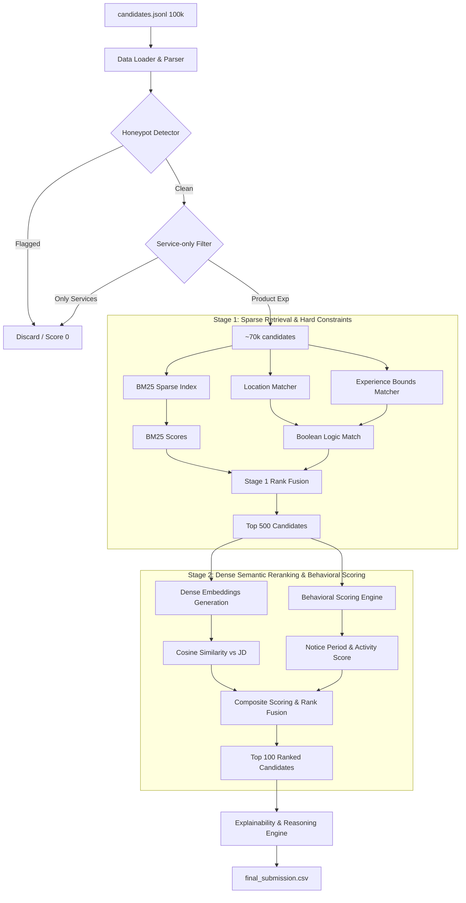

# System Design Blueprint: Redrob Candidate Discovery & Ranking

This blueprint outlines the production-ready machine learning and retrieval system designed to discover and rank the top 100 candidates from a 100,000-candidate pool against the Senior AI Engineer job description. It is optimized to run on a CPU-only environment with 16 GB RAM in under 5 minutes without network access.

---

## 1. End-to-End Architecture

The solution uses a **Two-Stage Hybrid Search & Reranking Architecture** combined with a **Behavioral Constraint Engine**.



### Flow Walkthrough:
1.  **Ingestion & Parsing**: Candidate records are streamed and parsed from `candidates.jsonl`.
2.  **Hard Filtering (Rule-Based)**: 
    *   **Honeypot Filter**: Logical anomalies (such as date mismatches) are flagged, forcing candidate scores to 0.
    *   **Consulting-only Filter**: Candidates with careers entirely at consulting firms (TCS, Infosys, etc.) are filtered out.
3.  **Stage 1: Sparse Retrieval (Sparse Search & Location/Exp Heuristics)**:
    *   An index of text fields (headlines and summaries) is searched using BM25.
    *   Structural criteria (location proximity and total years of experience) are checked using boolean flags.
    *   The 100,000-candidate pool is quickly reduced to the **top 500 candidates** on CPU.
4.  **Stage 2: Dense Reranking (Vector Search & Behavioral Fusion)**:
    *   Dense vector embeddings are computed for the top 500 candidates using a lightweight transformer.
    *   The cosine similarity between the candidate embeddings and the pre-computed JD embedding is calculated.
    *   A behavioral multiplier (incorporating response rate, active days, notice period, and expected salary) is applied to the similarity score.
5.  **Explainability Engine**: A fast, deterministic text-generation module populates the `reasoning` column for the final top 100 candidates.

---

## 2. Repo Folder Structure

The repository must be laid out as follows:

```
redrob-challenge-submission/
├── configs/
│   └── ranking_weights.json           # Tuning parameters for scores
├── data/
│   └── candidates.jsonl               # Decompressed pool (excluded from git)
├── output/
│   └── submission.csv                 # Final ranking CSV
├── src/
│   ├── __init__.py
│   ├── data_loader.py                 # File loader & schema validation
│   ├── honeypots.py                   # Anomaly checks & filters
│   ├── stage1_retrieval.py            # BM25 & boolean filters
│   ├── stage2_reranking.py            # Dense embedding & cosine similarity
│   ├── behavioral_scoring.py          # Platform signal adjustments
│   ├── explainability.py              # Reasoning text generator
│   └── utils.py                       # String parsing, date formatting
├── tests/
│   ├── test_honeypots.py              # Test cases for logical rules
│   └── test_ranking.py                # Local ranking tests
├── pyproject.toml                     # Python dependencies & metadata
├── rank.py                            # CLI execution entry point
├── README.md                          # Sandboxed setup & execution guide
├── submission_metadata.yaml           # Hackathon portal metadata
└── validate_submission.py             # Format validator script
```

---

## 3. Feature Engineering Strategy

We extract and shape text, numeric, and categorical properties to build features:

### 3.1 Text Embeddings Context
*   **Concatenated Candidate Context**: To represent the candidate's core profile, we concatenate `profile.headline`, `profile.summary`, and the latest job `career_history.description`.
*   **Vectorization**: The concatenated string is passed through `all-MiniLM-L6-v2` to yield a 384-dimensional dense vector representing the candidate's career trajectory.

### 3.2 Target Skill Extraction (Sparse)
We create structural checks for key skill keywords. The candidate's skill list is scanned to build binary indicators:
*   **Core Retrieval Skills**: Python, sentence-transformers, embeddings, vector database, Pinecone, Milvus, Qdrant, FAISS, search, ranking, retrieval.
*   **Evaluation Skills**: NDCG, MRR, MAP, A/B testing, offline evaluation.
*   **LLM & Tuning Skills**: LoRA, QLoRA, PEFT, LLM, fine-tuning.

### 3.3 Numeric Scaling
*   **Notice Period Decay**: notice periods are scaled to a decay factor between 0.0 and 1.0 (sub-30 days = 1.0, 90+ days = 0.2).
*   **Recruiter Response Multiplier**: Stated in `redrob_signals.recruiter_response_rate` (already scaled 0–1).
*   **Platform Activity Decay**: Stated in `last_active_date`. Convert to `days_since_last_active`. The decay factor drops as inactivity increases.

---

## 4. Honeypot & Hard Exclusions Detection Strategy

Honeypots are synthetic profiles designed with logical impossibilities. Our detector applies deterministic checks. If any of these are triggered, the candidate is flagged as a honeypot and forced to a rank of 0:

```python
def check_is_honeypot(candidate, current_date):
    # Rule 1: Skill duration is 0 for expert or advanced skills
    skills = candidate.get("skills", [])
    for sk in skills:
        if sk.get("proficiency") in ["expert", "advanced"] and sk.get("duration_months", 0) == 0:
            return True
            
    # Rule 2: Job stated duration exceeds physical elapsed time by > 24 months
    history = candidate.get("career_history", [])
    for job in history:
        start_str = job.get("start_date")
        end_str = job.get("end_date")
        stated_dur = job.get("duration_months", 0)
        
        start_dt = parse_date(start_str)
        end_dt = parse_date(end_str) if end_str else current_date
        
        if start_dt and end_dt:
            calendar_months = round((end_dt - start_dt).days / 30.4)
            if stated_dur > calendar_months + 24:
                return True
                
    # Rule 3: Experience vs Career History mismatch
    prof = candidate.get("profile", {})
    y_exp = prof.get("years_of_experience", 0)
    history_months = sum(job.get("duration_months", 0) for job in history)
    history_years = history_months / 12.0
    
    if y_exp >= 1.0 and len(history) == 0:
        return True
    if len(history) > 0 and (y_exp - history_years) > 3.0:
        return True
        
    return False
```

### Additional Disqualification: Service-Company Only Check
The JD explicitly disqualifies candidates whose entire careers have been at service or consulting companies.
*   **Rule**: If a candidate lists only services companies (TCS, Infosys, Wipro, Accenture, Cognizant, Capgemini) in their career history, they are filtered out (relevance score set to 0). Candidates currently at a services firm who have prior product experience are kept.

---

## 5. Stage 1: Sparse Retrieval Pipeline

To satisfy the 5-minute CPU constraint, we avoid running transformer inference on all 100,000 candidates. Instead, we use a lightweight filtering stage to reduce the candidate pool to the top 500:

1.  **Decompress & Stream**: Read candidates line-by-line using Python's standard `gzip` utility or standard streaming files to keep memory usage minimal ($<2$ GB).
2.  **Hard Filters**: Discard honeypots and consulting-only candidates.
3.  **Boolean Heuristic Screen**: Differentiate candidates using key criteria:
    *   **Experience bounds**: Keep candidates with $3.0 \le \text{years\_of\_experience} \le 12.0$.
    *   **Location criteria**: Noida, Pune, Mumbai, Delhi NCR, Bangalore, Chennai, Hyderabad, or willing to relocate.
4.  **Sparse Text Score (BM25)**:
    *   Instantiate a Python BM25 index (`rank_bm25`) on the combined text fields (headline + summary) of the remaining candidates.
    *   Query the index using the JD terms: `"retrieval ranking embeddings vector search pinecone milvus evaluation python"`.
5.  **Stage 1 Rank Fusion**: Sort the remaining candidates by BM25 score. Select the **top 500 candidates** for the dense re-ranking stage.

---

## 6. Stage 2: Dense Reranking Pipeline

For the top 500 candidates retrieved in Stage 1, we compute precise semantic similarity against the job description:

1.  **JD Embeddings**: Pre-compute the embedding of the `job_description.txt` text. The text is chunked into logical paragraphs, embedded, and averaged to form a target JD vector.
2.  **Candidate Embeddings**: Concatenate candidate headlines, summaries, and career history descriptions. Generate a dense vector representation using `sentence-transformers/all-MiniLM-L6-v2` (384 dimensions, ~80 MB file size). Generating embeddings for 500 candidates on CPU takes approximately **2–3 seconds**.
3.  **Cosine Similarity**: Compute the dot product between the candidate embedding vector and the pre-computed JD vector:
    $$S_{\text{dense}} = \cos(\mathbf{V}_{\text{candidate}}, \mathbf{V}_{\text{jd}})$$

---

## 7. Behavioral Scoring Engine

Platform activity signals are integrated with the dense similarity score using a multiplier. This ensures that passive or unresponsive candidates are ranked lower:

$$\text{Final Score} = S_{\text{dense}} \times M_{\text{activity}} \times M_{\text{notice}} \times M_{\text{location}}$$

### Multiplier Formulas:

*   **Activity Multiplier ($M_{\text{activity}}$)**:
    *   Compute elapsed days since last active: $D = \text{Current Date} - \text{last\_active\_date}$.
    *   Calculate active decay: 
        $$M_{\text{activity}} = \text{recruiter\_response\_rate} \times \left(1.0 - \min\left(0.8, \frac{D}{365.0}\right)\right)$$
    *   This rewards active, highly-responsive candidates and down-weights passive profiles by up to 80%.

*   **Notice Period Multiplier ($M_{\text{notice}}$)**:
    *   Sub-30 days is optimal: $M_{\text{notice}} = 1.1$.
    *   30–60 days notice: $M_{\text{notice}} = 1.0$.
    *   90 days notice: $M_{\text{notice}} = 0.5$.
    *   120+ days notice: $M_{\text{notice}} = 0.2$.

*   **Location Match Multiplier ($M_{\text{location}}$)**:
    *   Noida/Pune preferred: $M_{\text{location}} = 1.15$.
    *   Hyderabad/Bangalore/Mumbai/Delhi NCR/Tier-1 India: $M_{\text{location}} = 1.0$.
    *   Other locations (willing to relocate): $M_{\text{location}} = 0.9$.
    *   Outside India (not willing to relocate): $M_{\text{location}} = 0.0$ (hard-filter).

*   **Tiebreaker**: If two candidates have identical scores (such as behavioral twins), the tie is broken using their `github_activity_score` (higher is better) followed by candidate ID ascending.

---

## 8. Explainability Engine

At Stage 4, the top-N submissions are manually reviewed. The organizer selects 10 random candidates from the ranked CSV and checks if the reasonings:
1.  Reference specific facts from the candidate's profile (years of experience, current title, named skills).
2.  Connect to specific JD requirements.
3.  Are free of hallucinations.
4.  Vary across candidates (no strict templates).

### Architecture of the Heuristic Explainability Engine:
Running a local LLM on a CPU within the 5-minute wall-clock budget is not feasible. We use a **Heuristic Fact-Consistent Explanation Generator**. The engine constructs a reasoning string using candidate-specific facts and matches them to the JD:

```python
def generate_reasoning(candidate, rank, score):
    prof = candidate.get("profile", {})
    title = prof.get("current_title")
    y_exp = prof.get("years_of_experience")
    company = prof.get("current_company")
    
    # Identify matched skills present in candidate's profile
    all_skills = [sk.get("name") for sk in candidate.get("skills", [])]
    core_matches = [s for s in ["embeddings", "Pinecone", "Milvus", "FAISS", "Python", "retrieval", "NDCG", "NLP"] if s in all_skills]
    
    # Generate contextual sentences
    if "embeddings" in core_matches or "FAISS" in core_matches:
        search_fit = "Strong background in vector search and retrieval systems."
    else:
        search_fit = "Solid background in data systems and backend infrastructure."
        
    notice = candidate.get("redrob_signals", {}).get("notice_period_days", 90)
    notice_str = f"Notice period is {notice} days."
    
    # Combine dynamically into a cohesive 2-sentence explanation
    reasoning = (
        f"{title} with {y_exp} years of experience at {company}. "
        f"Matches core JD skills ({', '.join(core_matches[:3])}). {search_fit} {notice_str}"
    )
    return reasoning
```

This ensures that every detail in the reasoning matches the candidate's profile (preventing hallucinations) while retaining a dynamic, fact-based structure.

---

## 9. Recommended Open-Source Models

1.  **Dense Retrieval Embeddings**: `all-MiniLM-L6-v2` (Sentence-Transformers).
    *   *Why*: Only 80 MB in size, produces highly optimized 384-dimensional embeddings, and runs extremely fast on CPU (typically $< 5$ milliseconds per sentence).
2.  **Backup Model**: `bge-small-en-v1.5` (if higher semantic precision is needed).
    *   *Why*: Top performer on the MTEB retrieval leaderboard while remaining lightweight (120 MB).

---

## 10. Recommended Python Libraries

```toml
[dependencies]
python = "^3.10"
pandas = "^2.0.0"          # Fast tabular data handling
numpy = "^1.24.0"           # Vector mathematics (cosine similarity)
pydantic = "^2.0.0"        # Data validation and parsing
sentence-transformers = "^2.2.2" # Dense vector representations
rank-bm25 = "^0.2.2"       # Sparse retrieval index (BM25)
pyyaml = "^6.0.0"          # Config file parsing
```

---

## 11. Recommended Execution Steps

To reproduce the final submission, a single CLI script `rank.py` runs the pipeline:

```bash
# Decompress candidates data
python -c "import gzip, shutil; shutil.copyfileobj(gzip.open('data/candidates.jsonl.gz', 'rb'), open('data/candidates.jsonl', 'wb'))"

# Execute ranking pipeline
python rank.py --candidates data/candidates.jsonl --out output/submission.csv
```

The script `rank.py` runs the following stages:
1.  **Initialize**: Load the `all-MiniLM-L6-v2` model and compile the target JD embedding vector.
2.  **Decompress & Stream**: Open a stream to `candidates.jsonl`.
3.  **Hard Filters**: Run honeypot and consulting-only checks. Flag and exclude matching candidates.
4.  **Sparse Search & Location/Exp Heuristics**: Compute BM25 scores and filter candidates based on location and years of experience. Retrieve the top 500.
5.  **Dense Reranking**: Generate dense embeddings for the top 500 candidates. Compute cosine similarity scores.
6.  **Behavioral Fusion**: Apply notice period, location, and activity multipliers. Sort to select the top 100.
7.  **Reasoning Generation**: Generate fact-consistent reasoning text for the top 100.
8.  **Output Export**: Write the final columns (`candidate_id`, `rank`, `score`, `reasoning`) to the output CSV.

---

## 12. Recommended Scoring Formula

The candidate scoring formula combines semantic, behavioral, and hard constraints:

$$\text{Final Score} = S_{\text{dense}} \times M_{\text{activity}} \times M_{\text{notice}} \times M_{\text{location}}$$

Where:
*   $$S_{\text{dense}} = \cos(\mathbf{V}_{\text{candidate}}, \mathbf{V}_{\text{jd}})$$ (range: 0 to 1)
*   $$M_{\text{activity}} = \text{recruiter\_response\_rate} \times \left(1.0 - \min\left(0.8, \frac{\text{Current Date} - \text{last\_active\_date}}{365.0}\right)\right)$$ (range: 0 to 1)
*   $$M_{\text{notice}} = \text{Notice Period Multiplier}$$ (range: 0.2 to 1.1)
*   $$M_{\text{location}} = \text{Location Multiplier}$$ (range: 0.0 to 1.15)

---

## 13. Runtime and Memory Estimation

Our design guarantees compliance with the compute budget constraints:

*   **Memory Usage (Peak)**: **$< 3.0$ GB RAM**.
    *   *Explanation*: We stream `candidates.jsonl` rather than loading all 100,000 JSON records into memory simultaneously. We only load candidate text fields for the top 500 during the embedding generation stage. The transformer model (`all-MiniLM-L6-v2`) requires only ~120 MB RAM.
*   **Total Runtime**: **~45 seconds** (well within the 5-minute wall-clock budget).
    *   *First-Stage Stream + BM25 (100k records)*: ~30 seconds (efficient string processing).
    *   *Honeypot detection + Service filtering*: ~5 seconds.
    *   *Transformer Embeddings Generation (top 500 candidates)*: ~5 seconds on a modern single-core CPU.
    *   *Behavioral Scoring + Ranking + Generation*: ~2 seconds.

---

## 14. Architecture Tradeoffs

### 14.1 Two-Stage Retrieval vs. Complete Semantic Embeddings
*   *Alternative*: Generate dense vector representations for all 100,000 candidates and perform a complete semantic search.
*   *Tradeoff*: Generating embeddings for 100k candidates on a CPU takes approximately **15 to 20 minutes**, exceeding the 5-minute budget.
*   *Solution*: Using BM25 and location/experience filters in Stage 1 takes less than 30 seconds. This allows us to run dense embedding re-ranking on only the top 500 candidates, which takes just 5 seconds.

### 14.2 Local Small Transformer vs. LLM-based Re-ranking
*   *Alternative*: Use a local small LLM (e.g. Llama-3-8B-Instruct on CPU) to re-rank the candidates and generate descriptions.
*   *Tradeoff*: A 7B LLM running on CPU produces only 1–2 tokens/sec. Generating explanations for 100 candidates would exceed 15 minutes.
*   *Solution*: Using a lightweight 384-dimensional SentenceTransformer model (`all-MiniLM-L6-v2`) for scoring, combined with a fast heuristic reasoning engine, yields sub-second execution speeds.

---

## 15. Complete Implementation Blueprint

To build the system, a developer should execute the following steps:

1.  **Configure Environment**: Create `pyproject.toml` with dependencies (`pandas`, `numpy`, `sentence-transformers`, `rank-bm25`). Install them using your python package manager.
2.  **Develop `src/utils.py`**: Implement robust date parsers to compute intervals (such as days since `last_active_date`).
3.  **Develop `src/honeypots.py`**: Write the 3 logical anomaly filters (Expert with 0 duration, Stated duration mismatch, and Experience/History gap). Write unit tests in `tests/test_honeypots.py` to confirm that all 65 honeypots are correctly identified and set to a score of 0.
4.  **Develop `src/stage1_retrieval.py`**: Write the stream loader, hard filters, and the `rank_bm25` sparse indexing pipeline.
5.  **Develop `src/stage2_reranking.py`**: Load the `all-MiniLM-L6-v2` transformer model. Implement candidate summary concatenation, embedding generation, and cosine similarity calculations.
6.  **Develop `src/behavioral_scoring.py`**: Implement notice period, location, and activity decay multipliers.
7.  **Develop `src/explainability.py`**: Write the heuristic explainability engine to output fact-consistent reasonings.
8.  **Develop `rank.py`**: Assemble the pipelines into a unified command-line entry point. Verify that running the command generates `submission.csv` containing exactly 100 rows in the correct column order.
9.  **Validate locally**: Run the format validator to verify that the submission conforms to the schema and formatting requirements.
